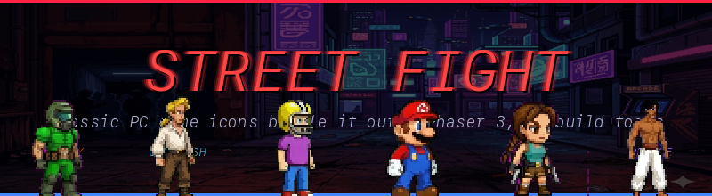
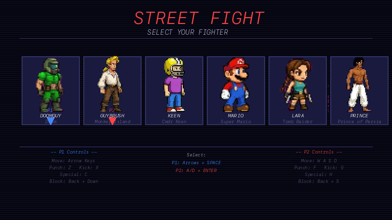
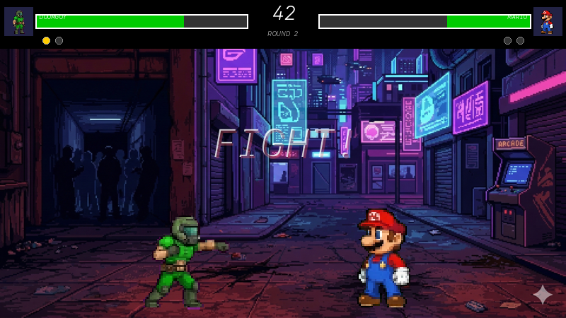

# Street Fight - Classic PC Game Characters



A browser-based fighting game where iconic classic PC game characters battle it out. **Local 2-player on desktop, single-player vs CPU on mobile/iOS.** Built with Phaser 3 — no build tools required.

## Screenshots





## Play

```bash
npx serve .
# or
python3 -m http.server 8080
```

Then open `http://localhost:8080` (or whatever port) in a browser.

## Characters

| Character | Game | Style | Special 1 | Special 2 |
|-----------|------|-------|-----------|-----------|
| **Doomguy** | Doom | Tank (110 HP) | Shotgun Blast (melee) | BFG (projectile) |
| **Guybrush** | Monkey Island | Trickster (90 HP) | Insult (stun) | Rubber Chicken (arc projectile) |
| **Cmdr Keen** | Commander Keen | Rushdown (90 HP) | Pogo Bounce (dive) | Ray Gun (projectile) |
| **Mario** | Super Mario | All-rounder (100 HP) | Fireball (bouncing projectile) | Stomp (dive) |
| **Lara Croft** | Tomb Raider | Agile (90 HP) | Dual Pistols (projectile) | Grapple Hook (long melee) |
| **Prince** | Prince of Persia | Acrobatic (95 HP) | Sword Dash (dive lunge) | Sand Rewind (projectile) |

## Controls

### Desktop (keyboard, 2-player local)

| Action | Player 1 | Player 2 |
|--------|----------|----------|
| Move | Arrow Keys | W A S D |
| Punch | Z | F |
| Kick | X | G |
| Special | C | H |
| Alt Special | Down + C | S + H |
| Block | Back + Down | Back + S |
| Jump | Up | W |

**Character Select:** P1 uses Arrow Keys + SPACE, P2 uses A/D + ENTER.

**Victory Screen:** SPACE/ENTER for character select, Z/F for rematch.

### Mobile / iOS (touch, vs CPU)

On phones the game switches to single-player: you tap a fighter, tap **FIGHT**, and the CPU picks an opponent.

| Action | Touch |
|--------|-------|
| Move left / right | ◀ ▶ on the D-pad |
| Jump | ▲ (tap) |
| Crouch | ▼ (hold) |
| Punch / Kick / Special | Action buttons on the right |
| Alt Special | Hold ▼ + tap SPECIAL |
| Block | Hold BLK |
| Help / controls | HELP button (top-right) |

- Best played in **landscape** — a rotate prompt appears in portrait.
- A how-to-play overlay is shown on first load.
- Character Select and Victory screens are fully tappable (FIGHT / REMATCH / CHAR SELECT buttons).

## Game Mechanics

- **Best of 3 rounds** with 99-second timer
- **Blocking** (hold back + down, or dedicated BLK button on mobile) reduces damage to 15% and knockback to 30%
- **Holding back** while walking also passively blocks incoming attacks
- **Frame data** per move: startup, active (hitbox on), recovery frames
- **Projectiles**: max 1 per player on screen, with sprite and glow effects
- **Auto-facing**: fighters always face each other
- **KO effects**: slow-motion, screen flash, camera shake
- **CPU opponent (mobile)**: simple AI that approaches, attacks in range, throws occasional specials, and reactively blocks

## Tech Stack

- **Phaser 3.90.0** loaded from CDN
- Plain HTML + vanilla JS (no build tools, no bundler)
- Arcade physics for gravity/collisions
- Synthesized sound effects via Web Audio API
- AI-generated pixel art sprites (64x64 frames, 8x6 grid sprite sheets)
- Resolution: 800x450, pixelArt mode, `Phaser.Scale.FIT` (auto-scales to device)
- HTML overlay for mobile touch controls (no extra dependencies)

## Project Structure

```
streetfight/
  index.html                  # Entry point, loads Phaser + all scripts
  js/
    main.js                   # Phaser config + game init
    scenes/
      BootScene.js            # Asset loading + animation definitions
      CharacterSelectScene.js # 6-character select with controls display
      FightScene.js           # Core gameplay, rounds, slow-mo KO
      VictoryScene.js         # Winner display, rematch/reselect
    fighters/
      Fighter.js              # Sprite-based state machine + combat
      characters.js           # All 6 character definitions (stats, moves)
    systems/
      InputManager.js         # Key bindings + touch input merge for both players
      AIController.js         # CPU opponent (used for P2 on mobile)
      CombatSystem.js         # Hitbox checks, damage, projectiles, effects
    ui/
      HUD.js                  # Health bars, timer, round indicators
  assets/
    sprites/                  # Character sprite sheets + projectiles
    backgrounds/              # Stage background
```

## Sprite Generation

Sprite sheets are 512x384 PNG files (8 columns x 6 rows of 64x64 frames). Generated with AI image tools using solid color backgrounds (#FF00FF magenta or #0000FF blue) then color-keyed to transparency.

### Frame Layout

| Row | Frames | Animation |
|-----|--------|-----------|
| 1 | 0-3, 4-7 | Idle (4), Walk start (4) |
| 2 | 8-9, 10-12, 13-15 | Walk end (2), Jump (3), Punch (3) |
| 3 | 16-19, 20-23 | Kick (4), Special1 (4) |
| 4 | 24-30, 31 | Special2 (7), blank |
| 5 | 32, 33-35, 36-39 | Block (1), Hit (3), KO (4) |
| 6 | 40-45, 46-47 | Victory (6), blank |
